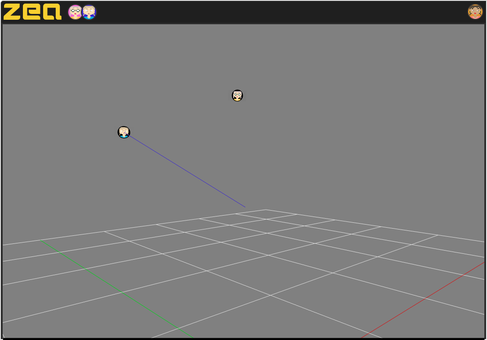

# Setting up 3D Collaboration

Zea Collab allows multiple users to collaborate on the same 3D scene at the same time.

Try sharing the current page with a friend, or you could even open it in a new browser tab, and take a look at the [live demo below 🎥 ](#live-demo). You should see something like this:

📷 Multiple users on the same 3D scene:

## Live demo

🎥 Live demo of multiple users on the same 3D scene:

<!-- Copy and Paste Me -->

  <iframe
    src="https://glitch.com/embed/#!/embed/zea-collab-3d-example?path=README.md&previewSize=100&attributionHidden=true"
    title="zea-demo-3d-collab on Glitch"
    allow="geolocation; microphone; camera; midi; vr; encrypted-media"
    style="height: 100%; width: 100%; border: 0;">
  </iframe>

